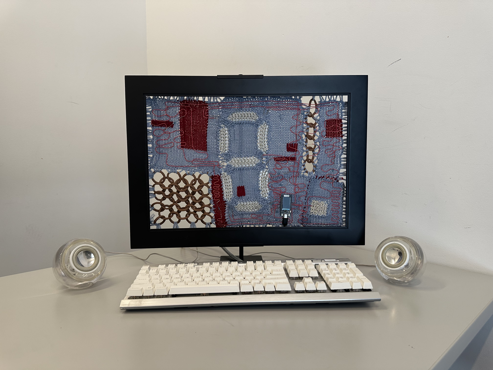

# Final Project: Computational Histories

This piece explores the deep historical connection between textiles and computing through the symbol of the bit. The role of the bit as the core building block of all computer programs reminded me of the stitch in knit or woven textiles - both of these foundational elements are simple and almost meaningless alone, but combined in wonderful and complex ways they have a near-endless range of possibility. In this piece, the textile “screen” features a seven-segment chainmail display that lights up with 0s and 1s, showing the bitwise representation of the characters typed on the keyboard.

Six panels in the seven-segment display are lit by LED backlight panels behind the chainmail patches (the seventh isn't needed because I'm only displaying 0s and 1s). Each LED is controlled by GPIO pins that turn on and off based on the keyboard input. They also brighten gradually when playing the startup sound. The capacitive touch button is connected to the ESP-32, which and plays the startup sound when pressed, with copper wire woven through the conductive aluminum chainmail to make the entire button capacitive. Controlling the GPIO pins and managing all 6 LEDs at once (it was slightly hit or miss how many I could power given overall amperage limits on the ESP-32 with the display) was a new skill that built on what I learned in our first PCB LED circuit module. I experimented extensively with different resistor values to ensure the panels were bright enough, ultimately settling on 9.4 Ohms (2 x 4.7 Ohm resistors) per LED.

When characters are typed on the USB keyboard plugged into my laptop, they are written to the ESP-32 serial monitor via web serial on a webpage. This page also listens for the ESP-32 to send a serial message that the capacitive touch button has been pressed, indicating that the startup sound should be played, or a message that there is duplicate keyboard input indicating that the the boop sound should be played. The ESP-32 is plugged into my laptop as well -- I needed USB power or another external power source stronger than our lithium ion batteries to power all of the LEDs, and the cord plugged into the screen makes sense with the image of a monitor on a desk, which would usually have a power cord anyway.
